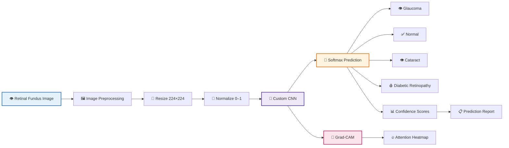
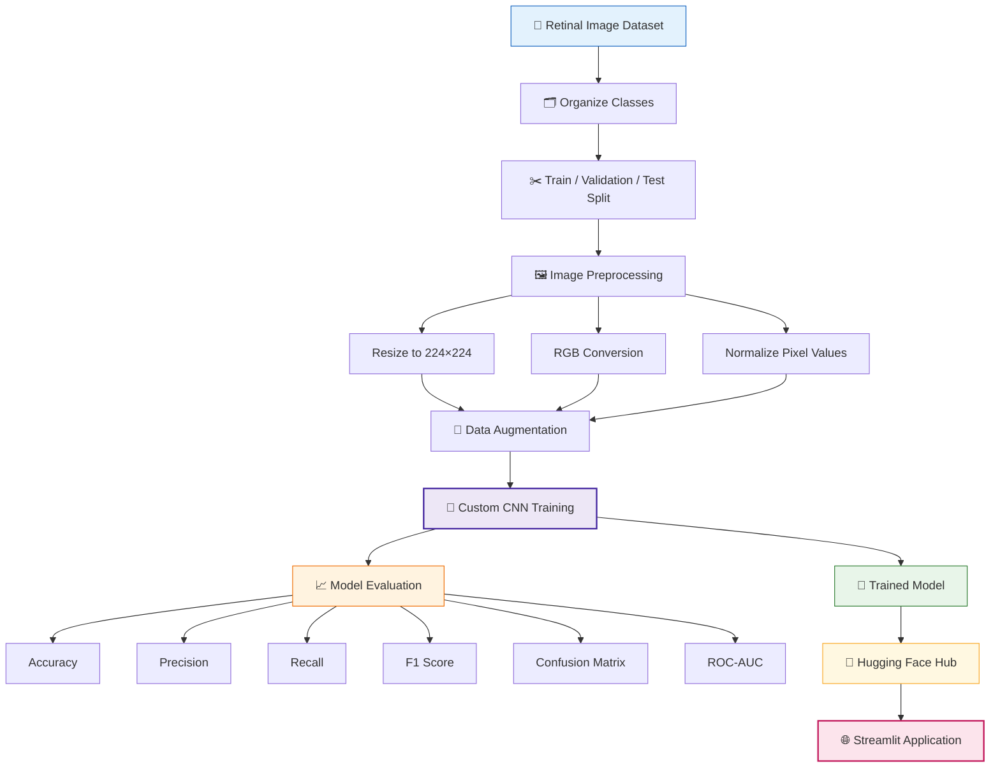
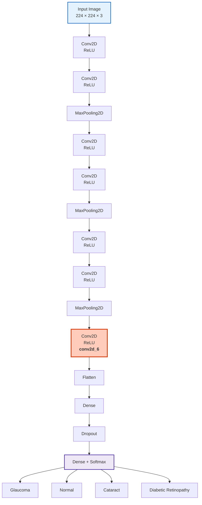
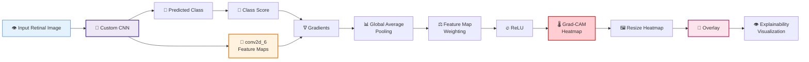
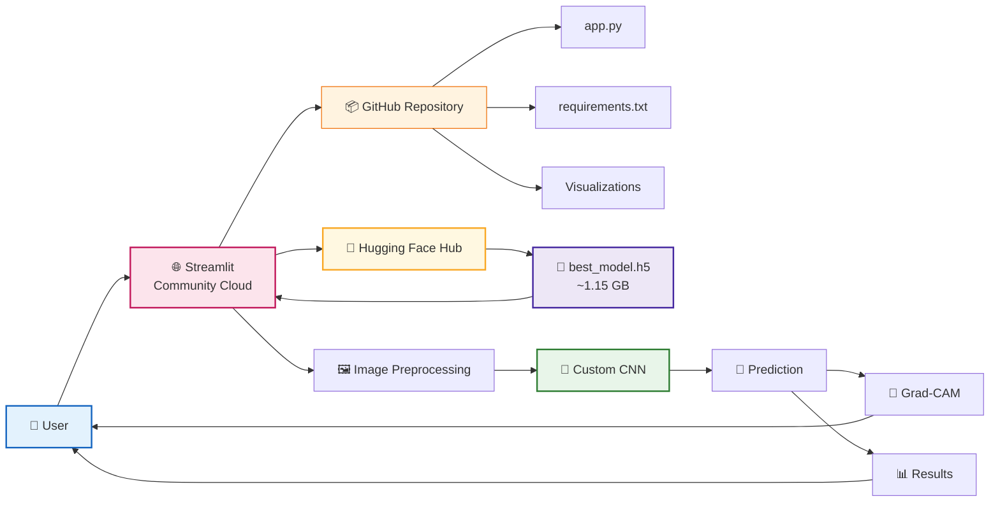

# 👁️ Eye Diseases Classification With Streamlit App

A deep learning project that classifies retinal fundus images into four categories of eye conditions using a **Custom CNN** and **EfficientNetB7 (transfer learning)**.

---

## 🚀 Live Demo

👉 **[Try the Live Application](https://ocular-diseases-detection-atharva-salitri.streamlit.app/)**

> ⚠️ This application is for educational and research demonstration
> purposes only. It is not a medical diagnostic tool.

## 🩺 Problem Statement

Early diagnosis of eye diseases like **Cataract**, **Glaucoma**, and **Diabetic Retinopathy** is critical for vision preservation. This project aims to automate disease detection from retinal images using Convolutional Neural Networks.

---

## 📂 Dataset Overview

The dataset includes approximately **4200** high-resolution fundus images categorized into:

| Class                | Images |
| -------------------- | ------ |
| Cataract             | 1038   |
| Diabetic Retinopathy | 1098   |
| Glaucoma             | 1007   |
| Normal               | 1074   |

You can collect datasets from:

- 🔗 [Eye Disease Retinal Images Dataset (Kaggle)](https://www.kaggle.com/datasets/gunavenkatdoddi/eye-diseases-classification)

## 🧠 Models

### 🔧 1. Custom CNN

A 4-block CNN model built from scratch with ReLU activations, MaxPooling, and a fully connected head.

**Performance:**

Test Accuracy : 89%

Class-wise F1 Scores:

Glaucoma : 0.79

Normal : 0.85

Diabetic Retinopathy : 0.99

Cataract : 0.91

### ⚡ 2. EfficientNetB7 (Transfer Learning)

Uses ImageNet-pretrained EfficientNetB7 as the base model with added custom top layers.

**Performance:**

Test Accuracy : 95%

Class-wise F1 Scores:

Glaucoma : 0.92

Normal : 0.94

Diabetic Retinopathy : 0.97

Cataract : 0.97

---

## 🧠 Methodology

The project follows these main steps:

1. Collect and organize retinal images.
2. Resize images to **224 × 224 × 3**.
3. Normalize pixel values to the range **0–1**.
4. Apply image augmentation during training.
5. Train a deep learning CNN model.
6. Evaluate the model using accuracy, precision, recall, F1-score, confusion matrix, and ROC-AUC.
7. Deploy the trained model using Streamlit.
8. Use Grad-CAM to provide visual explanations of predictions.

---

## 🤖 Model

The final application uses a **Custom CNN** trained from scratch.

The CNN contains:

- Convolutional layers
- Batch Normalization
- ReLU activation
- MaxPooling
- Dropout
- Fully connected layers
- Softmax output layer

The model predicts four classes:

- Glaucoma
- Normal
- Cataract
- Diabetic Retinopathy

The saved model used by the original application is approximately **1.15 GB**.

---

## ⚙️ Training Configuration

- **Image Size:** 224 × 224 × 3
- **Batch Size:** 32
- **Optimizer:** Adam
- **Loss:** Sparse Categorical Crossentropy
- **Maximum Epochs:** 200
- **Data Augmentation:** Rotation and horizontal flipping
- **Callbacks:**
  - EarlyStopping
  - ModelCheckpoint
  - ReduceLROnPlateau

---

## 📊 Evaluation

The model was evaluated using:

- Accuracy
- Precision
- Recall
- F1-score
- Confusion Matrix
- ROC Curve
- AUC

The model achieved approximately **85–90% test accuracy** depending on the trained version and evaluation run.

Class-wise performance showed that **Diabetic Retinopathy** was classified particularly well, while **Glaucoma** and **Normal** had comparatively more confusion.

---

## 🔬 Explainable AI

The application uses **Grad-CAM (Gradient-weighted Class Activation Mapping)** to visualize areas of the retinal image that contributed to the model's prediction.

Grad-CAM is provided for interpretability and should not be considered a clinical explanation.

---

## 🌐 Streamlit Application

The Streamlit application provides:

- 👁️ Left and right eye image upload
- 🎯 Disease prediction
- 📊 Class confidence scores
- 📈 Model visualizations
- 🔬 Grad-CAM heatmaps
- 🩺 Left/right eye comparison
- 📋 Downloadable prediction reports
- 📚 Disease information
- ⚠️ Medical disclaimer

---

## Diagrams:

### 🧠 Project Architecture



### 🔬 Machine Learning Pipeline



### 🧠 Custom CNN Architecture



### 🔥 Grad-CAM Explainability



### ☁️ Deployment Architecture



## 📁 Project Structure

```text
Eye-Disease-Classification/
│
├── app.py
├── best_model.h5
├── README.md
├── requirements.txt
├── diabetic-eye-issues-5-ways-diabetes-impacts-vision.jpg
│
└── Visualizations/
    ├── 01_distribution.png
    ├── 02_train_test.png
    ├── 03_model_building.png
    ├── 04_evaluate.png
    └── 05_confusion_matrix.png
```

## ⚙️ Requirements

Install the required Python packages:

```bash
pip install -r requirements.txt
```

## ▶️ How to Run

1. Open the project folder

Open a terminal inside the project directory containing app.py.

2. Install dependencies
   pip install -r requirements.txt

3. Make sure the model is present

Place:

best_model.h5

in the same directory as:

app.py

4. Run the Streamlit application
   streamlit run app.py

5. Open the application

After running the command, Streamlit will provide a local URL such as:

http://localhost:8501

Open the URL in your browser.
