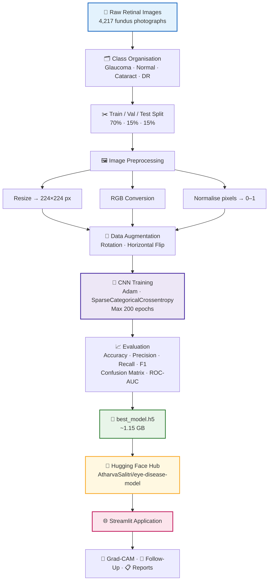
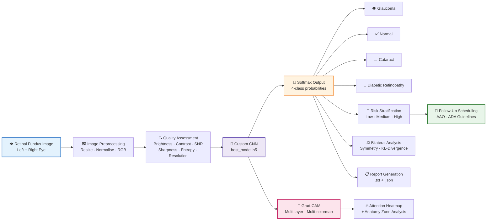
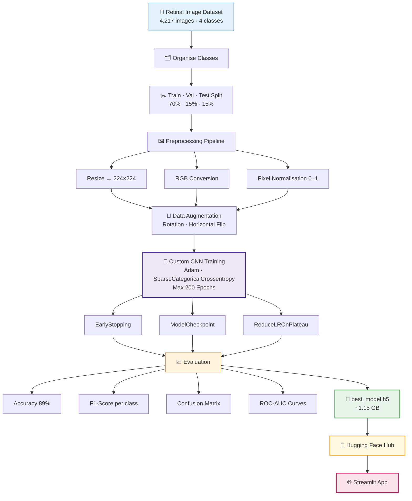
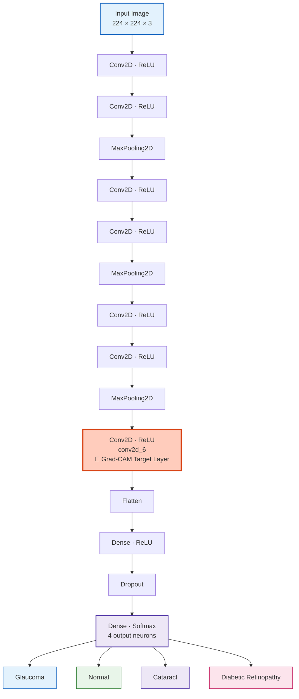
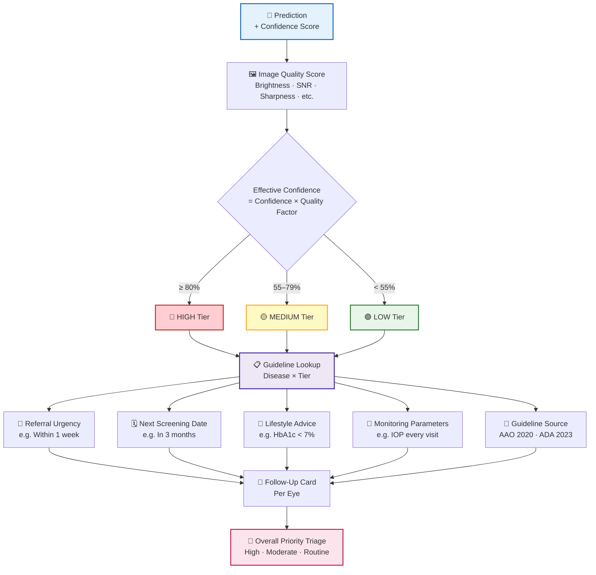
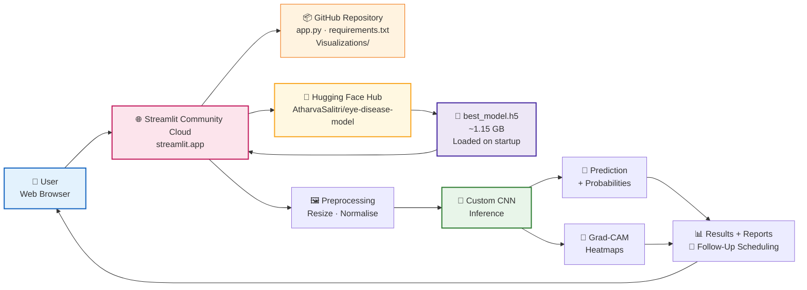
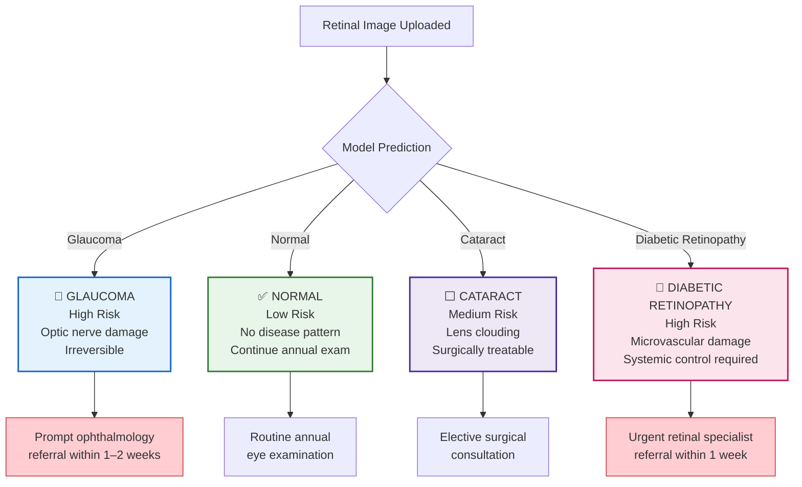

<div align="center">

# 👁️ Ocular Disease Detection

### AI-Powered Retinal Image Classification with Explainable AI

[](https://ocular-diseases-detection-using-cnn-atharva-salitri.streamlit.app/)
[](https://www.python.org/)
[](https://www.tensorflow.org/)
[](https://keras.io/)
[](https://streamlit.io/)
[](https://huggingface.co/AtharvaSalitri/eye-disease-model)
[](LICENSE)

<br/>

**A production-ready deep learning system for early detection of ocular diseases from retinal fundus photographs — featuring Grad-CAM explainability, bilateral eye analysis, risk stratification, and clinical follow-up scheduling.**

<br/>

> ⚠️ **Medical Disclaimer:** This application is for **educational and research demonstration purposes only**.
> It is **NOT** a medical diagnostic tool. Always consult a qualified ophthalmologist.

</div>

---

## 📋 Table of Contents

- [Live Demo](#-live-demo)
- [Overview](#-overview)
- [Problem Statement](#-problem-statement)
- [Dataset](#-dataset)
- [Model Architecture](#-model-architecture)
- [Methodology](#-methodology)
- [Training Configuration](#-training-configuration)
- [Model Performance](#-model-performance)
- [Application Features](#-application-features)
- [Explainable AI](#-explainable-ai)
- [Project Architecture](#-project-architecture)
- [ML Pipeline](#-ml-pipeline)
- [CNN Architecture](#-cnn-architecture)
- [Grad-CAM Pipeline](#-grad-cam-pipeline)
- [Follow-Up Scheduling](#-follow-up-scheduling)
- [Deployment Architecture](#-deployment-architecture)
- [Project Structure](#-project-structure)
- [Requirements](#-requirements)
- [How to Run](#-how-to-run)
- [Tab-by-Tab Guide](#-tab-by-tab-guide)
- [Disease Reference](#-disease-reference)
- [Limitations](#-limitations)
- [Acknowledgements](#-acknowledgements)

---

## 🚀 Live Demo

<div align="center">

### 👉 [**Try the Live Application →**](https://ocular-diseases-detection-using-cnn-atharva-salitri.streamlit.app/)

</div>

The application is deployed on **Streamlit Community Cloud** and loads the trained model (~1.15 GB) from **Hugging Face Hub** on startup. No local installation required to try it.

---

## 🔭 Overview

Ocular Disease Detection is an end-to-end deep learning project that:

- **Classifies** retinal fundus images into 4 categories: Glaucoma, Normal, Cataract, and Diabetic Retinopathy
- **Explains** predictions visually using Grad-CAM heatmaps with multi-layer and multi-colormap support
- **Assesses** image quality across 6 technical dimensions before prediction
- **Compares** left and right eye predictions with bilateral symmetry analysis
- **Generates** structured diagnostic reports (`.txt` and `.json`)
- **Schedules** clinical follow-up recommendations based on AAO/ADA guidelines

---

## 🩺 Problem Statement

Ocular diseases are among the leading causes of preventable blindness worldwide:

| Disease                  | Global Burden                 | Reversibility                              |
| ------------------------ | ----------------------------- | ------------------------------------------ |
| **Glaucoma**             | ~80 million affected          | ❌ Irreversible — early detection critical |
| **Cataract**             | ~94 million visually impaired | ✅ Reversible with surgery                 |
| **Diabetic Retinopathy** | ~103 million affected         | ⚠️ Partially — progression preventable     |
| **Normal**               | —                             | —                                          |

Manual screening by ophthalmologists is expensive, slow, and limited in reach — particularly in underserved regions. This project demonstrates how CNNs can assist in automated screening from retinal photography, enabling earlier intervention and better patient outcomes.

---

## 📂 Dataset

**Source:** [Eye Diseases Classification — Kaggle](https://www.kaggle.com/datasets/gunavenkatdoddi/eye-diseases-classification)

The dataset contains approximately **4,200** high-resolution retinal fundus images across 4 balanced classes:

| Class                | Images    | ICD-10 Code | Risk Level |
| -------------------- | --------- | ----------- | ---------- |
| Cataract             | 1,038     | H26         | 🟡 Medium  |
| Diabetic Retinopathy | 1,098     | E11.3       | 🔴 High    |
| Glaucoma             | 1,007     | H40         | 🔴 High    |
| Normal               | 1,074     | Z01.00      | 🟢 Low     |
| **Total**            | **4,217** |             |            |

### Dataset Split

```
Total: 4,217 images
├── Train:      70%  (~2,952 images)
├── Validation: 15%  (~633 images)
└── Test:       15%  (~632 images)
```

---

## 🧠 Model Architecture

Two models were trained and evaluated:

### 1. Custom CNN (Used in Production)

A 4-block convolutional network built from scratch:

| Layer Block | Components                                                    |
| ----------- | ------------------------------------------------------------- |
| Block 1     | Conv2D → Conv2D → MaxPooling2D                                |
| Block 2     | Conv2D → Conv2D → MaxPooling2D                                |
| Block 3     | Conv2D → Conv2D → MaxPooling2D                                |
| Block 4     | Conv2D (conv2d_6 — Grad-CAM target)                           |
| Head        | Flatten → Dense (ReLU) → Dropout → Dense (Softmax, 4 classes) |

### 2. EfficientNetB7 (Transfer Learning — Comparison)

ImageNet-pretrained EfficientNetB7 backbone with custom classification head.

---

## 🔬 Methodology


```mermaid
flowchart TD
    A["📂 Raw Retinal Images\n4,217 fundus photographs"] --> B["🗂️ Class Organisation\nGlaucoma · Normal · Cataract · DR"]
    B --> C["✂️ Train / Val / Test Split\n70% · 15% · 15%"]
    C --> D["🖼️ Image Preprocessing"]
    D --> D1["Resize → 224×224 px"]
    D --> D2["RGB Conversion"]
    D --> D3["Normalise pixels → 0–1"]
    D1 & D2 & D3 --> E["🔄 Data Augmentation\nRotation · Horizontal Flip"]
    E --> F["🧠 CNN Training\nAdam · SparseCategoricalCrossentropy\nMax 200 epochs"]
    F --> G["📈 Evaluation\nAccuracy · Precision · Recall · F1\nConfusion Matrix · ROC-AUC"]
    G --> H["💾 best_model.h5\n~1.15 GB"]
    H --> I["🤗 Hugging Face Hub\nAtharvaSalitri/eye-disease-model"]
    I --> J["🌐 Streamlit Application"]
    J --> K["🔬 Grad-CAM · 📅 Follow-Up · 📋 Reports"]

    style A fill:#e3f2fd,stroke:#1565c0,stroke-width:2px
    style F fill:#ede7f6,stroke:#4527a0,stroke-width:2px
    style H fill:#e8f5e9,stroke:#2e7d32,stroke-width:2px
    style I fill:#fff8e1,stroke:#f9a825,stroke-width:2px
    style J fill:#fce4ec,stroke:#c2185b,stroke-width:2px
```

---

## ⚙️ Training Configuration

| Parameter             | Value                                             |
| --------------------- | ------------------------------------------------- |
| **Image Size**        | 224 × 224 × 3                                     |
| **Batch Size**        | 32                                                |
| **Optimizer**         | Adam                                              |
| **Loss Function**     | Sparse Categorical Crossentropy                   |
| **Maximum Epochs**    | 200                                               |
| **Data Augmentation** | Rotation + Horizontal Flip                        |
| **Callbacks**         | EarlyStopping, ModelCheckpoint, ReduceLROnPlateau |
| **Framework**         | TensorFlow 2.21.0 / Keras 3.15.1                  |

---

## 📊 Model Performance

### Custom CNN

| Metric            | Value |
| ----------------- | ----- |
| **Test Accuracy** | 89%   |

| Class                | Precision | Recall | F1-Score |
| -------------------- | --------- | ------ | -------- |
| Glaucoma             | —         | —      | **0.79** |
| Normal               | —         | —      | **0.85** |
| Diabetic Retinopathy | —         | —      | **0.99** |
| Cataract             | —         | —      | **0.91** |

### EfficientNetB7 (Transfer Learning — Reference)

| Metric            | Value |
| ----------------- | ----- |
| **Test Accuracy** | 95%   |

| Class                | F1-Score |
| -------------------- | -------- |
| Glaucoma             | **0.92** |
| Normal               | **0.94** |
| Diabetic Retinopathy | **0.97** |
| Cataract             | **0.97** |

> The production application uses the **Custom CNN** to keep the deployment lightweight and interpretable with Grad-CAM.

---

## ✨ Application Features

The Streamlit application provides 10 tabs with the following capabilities:

| Tab                | Feature             | Description                                                                 |
| ------------------ | ------------------- | --------------------------------------------------------------------------- |
| 📖 About           | Project overview    | Goals, feature list, tech stack                                             |
| 🔍 Predict         | Upload & classify   | Both eyes, image quality assessment, confidence bars, risk badges           |
| 🔬 Explainable AI  | Grad-CAM            | Multi-layer selection, 6 colormaps, overlay download, attention focus score |
| 📊 Analysis        | Deep image analysis | RGB histograms, quality side-by-side table, counterfactual stability        |
| ⚖️ Bilateral       | Eye comparison      | Symmetry score, KL-divergence, per-class delta chart, clinical guidance     |
| 📋 Report          | Diagnostic report   | Probability bars, downloadable `.txt` + `.json`                             |
| 📅 Follow-Up       | Clinical scheduling | AAO/ADA guideline-based referral, lifestyle & monitoring per eye            |
| 📈 Visualizations  | Training charts     | Distribution, curves, confusion matrix, ROC-AUC, F1 comparison              |
| 📚 Disease Library | Education           | ICD codes, prevalence, screening frequency, symptoms, risk factors          |
| ⚙️ How It Works    | Technical pipeline  | Step-by-step explanation, architecture, tech stack                          |

### Key Feature Highlights

- **Image Quality Assessment** — 6 dimensions: brightness, contrast, sharpness, SNR, entropy, resolution. Degrades effective confidence on poor images.
- **Risk Stratification** — Every prediction mapped to Low / Medium / High clinical risk tier with recommended action.
- **Preprocessing Preview** — 4 transformation views (original, contrast-enhanced, grayscale, edge-detected) shown before prediction.
- **Attention Focus Score** — Gini-based concentration metric on the Grad-CAM heatmap.
- **Counterfactual Stability** — Margin between top and runner-up class confidence.
- **Session History** — Sidebar tracker of all analyses run in the current session.
- **Downloadable Grad-CAM overlays** — PNG export for each eye.

---

## 🔬 Explainable AI

### Grad-CAM (Gradient-weighted Class Activation Mapping)

Grad-CAM produces a spatial heatmap showing which regions of the retinal image contributed most to the predicted class.


```mermaid
flowchart LR
    A["👁️ Input Retinal Image\n224×224×3"] --> B["🧠 Custom CNN\nForward Pass"]
    B --> C["🎯 Predicted Class Score\ne.g. Glaucoma: 0.91"]
    B --> D["🔲 conv2d_6\nFeature Maps\n(H × W × C)"]
    C --> E["∇ Gradients\nw.r.t. Feature Maps"]
    D --> E
    E --> F["📊 Global Average Pooling\nper-channel importance weights\n(C,)"]
    F --> G["⚖️ Weighted Sum\nof Feature Maps"]
    G --> H["🔆 ReLU\nkeep positive influence only"]
    H --> I["🌡️ Normalise → 0–1\nGrad-CAM Heatmap"]
    I --> J["🖼️ Bilinear Upsample\nto original image size"]
    J --> K["🎨 Colormap Overlay\nJet · Hot · Inferno\nPlasma · Viridis · RdYlGn"]
    K --> L["👁️ Explainability\nVisualization"]

    style A fill:#e3f2fd,stroke:#1565c0,stroke-width:2px
    style B fill:#ede7f6,stroke:#4527a0,stroke-width:2px
    style D fill:#fff3e0,stroke:#ef6c00,stroke-width:2px
    style I fill:#ffcdd2,stroke:#c62828,stroke-width:2px
    style L fill:#fce4ec,stroke:#c2185b,stroke-width:2px
```

**Supported Conv Layers:** Any `Conv2D` layer in the model can be selected as the Grad-CAM target — earlier layers show fine texture patterns, deeper layers show semantic features.

> ⚠️ Grad-CAM heatmaps represent **model attention**, not anatomical disease locations. They are interpretability visualisations, not clinical localisations.

---

## 🏗️ Project Architecture


```mermaid
flowchart LR
    A["👁️ Retinal Fundus Image\nLeft + Right Eye"] --> B["🖼️ Image Preprocessing\nResize · Normalise · RGB"]
    B --> C["🔍 Quality Assessment\nBrightness · Contrast · SNR\nSharpness · Entropy · Resolution"]
    C --> D["🧠 Custom CNN\nbest_model.h5"]
    D --> E["🎯 Softmax Output\n4-class probabilities"]
    E --> F["👁️ Glaucoma"]
    E --> G["✅ Normal"]
    E --> H["⬜ Cataract"]
    E --> I["🔴 Diabetic Retinopathy"]
    D --> J["🔬 Grad-CAM\nMulti-layer · Multi-colormap"]
    J --> K["🔥 Attention Heatmap\n+ Anatomy Zone Analysis"]
    E --> L["🚦 Risk Stratification\nLow · Medium · High"]
    L --> M["📅 Follow-Up Scheduling\nAAO · ADA Guidelines"]
    E --> N["⚖️ Bilateral Analysis\nSymmetry · KL-Divergence"]
    E --> O["📋 Report Generation\n.txt + .json"]

    style A fill:#e3f2fd,stroke:#1565c0,stroke-width:2px
    style D fill:#ede7f6,stroke:#4527a0,stroke-width:2px
    style E fill:#fff3e0,stroke:#ef6c00,stroke-width:2px
    style J fill:#fce4ec,stroke:#c2185b,stroke-width:2px
    style M fill:#e8f5e9,stroke:#2e7d32,stroke-width:2px
```

---

## 🔄 ML Pipeline


```mermaid
flowchart TD
    A["📂 Retinal Image Dataset\n4,217 images · 4 classes"] --> B["🗂️ Organise Classes"]
    B --> C["✂️ Train · Val · Test Split\n70% · 15% · 15%"]
    C --> D["🖼️ Preprocessing Pipeline"]
    D --> D1["Resize → 224×224"]
    D --> D2["RGB Conversion"]
    D --> D3["Pixel Normalisation 0–1"]
    D1 & D2 & D3 --> E["🔄 Data Augmentation\nRotation · Horizontal Flip"]
    E --> F["🧠 Custom CNN Training\nAdam · SparseCategoricalCrossentropy\nMax 200 Epochs"]
    F --> G1["EarlyStopping"]
    F --> G2["ModelCheckpoint"]
    F --> G3["ReduceLROnPlateau"]
    G1 & G2 & G3 --> H["📈 Evaluation"]
    H --> H1["Accuracy 89%"]
    H --> H2["F1-Score per class"]
    H --> H3["Confusion Matrix"]
    H --> H4["ROC-AUC Curves"]
    H --> I["💾 best_model.h5\n~1.15 GB"]
    I --> J["🤗 Hugging Face Hub"]
    J --> K["🌐 Streamlit App"]

    style A fill:#e3f2fd,stroke:#1565c0
    style F fill:#ede7f6,stroke:#4527a0,stroke-width:2px
    style H fill:#fff3e0,stroke:#ef6c00
    style I fill:#e8f5e9,stroke:#2e7d32,stroke-width:2px
    style J fill:#fff8e1,stroke:#f9a825,stroke-width:2px
    style K fill:#fce4ec,stroke:#c2185b,stroke-width:2px
```

---

## 🧠 CNN Architecture


```mermaid
flowchart TD
    A["Input Image\n224 × 224 × 3"]
    A --> B1["Conv2D · ReLU"]
    B1 --> B2["Conv2D · ReLU"]
    B2 --> B3["MaxPooling2D"]
    B3 --> C1["Conv2D · ReLU"]
    C1 --> C2["Conv2D · ReLU"]
    C2 --> C3["MaxPooling2D"]
    C3 --> D1["Conv2D · ReLU"]
    D1 --> D2["Conv2D · ReLU"]
    D2 --> D3["MaxPooling2D"]
    D3 --> E1["Conv2D · ReLU\nconv2d_6\n🎯 Grad-CAM Target Layer"]
    E1 --> F["Flatten"]
    F --> G["Dense · ReLU"]
    G --> H["Dropout"]
    H --> I["Dense · Softmax\n4 output neurons"]
    I --> P["Glaucoma"]
    I --> Q["Normal"]
    I --> R["Cataract"]
    I --> S["Diabetic Retinopathy"]

    style A fill:#e3f2fd,stroke:#1565c0,stroke-width:2px
    style E1 fill:#ffccbc,stroke:#d84315,stroke-width:3px
    style I fill:#ede7f6,stroke:#4527a0,stroke-width:2px
    style P fill:#e3f2fd,stroke:#1565c0
    style Q fill:#e8f5e9,stroke:#2e7d32
    style R fill:#ede7f6,stroke:#4527a0
    style S fill:#fce4ec,stroke:#c2185b
```

---

## 📅 Follow-Up Scheduling

The app generates **clinical follow-up recommendations** for each eye based on:

1. **Predicted disease class**
2. **Model confidence** (adjusted by image quality)
3. **Published guidelines** — AAO Preferred Practice Patterns + ADA Standards of Care 2023


```mermaid
flowchart TD
    A["🎯 Prediction\n+ Confidence Score"] --> B["🖼️ Image Quality Score\nBrightness · SNR · Sharpness · etc."]
    B --> C{"Effective Confidence\n= Confidence × Quality Factor"}
    C -->|"≥ 80%"| D["🔴 HIGH Tier"]
    C -->|"55–79%"| E["🟡 MEDIUM Tier"]
    C -->|"< 55%"| F["🟢 LOW Tier"]

    D --> G["📋 Guideline Lookup\nDisease × Tier"]
    E --> G
    F --> G

    G --> H["🏥 Referral Urgency\ne.g. Within 1 week"]
    G --> I["🗓️ Next Screening Date\ne.g. In 3 months"]
    G --> J["🥗 Lifestyle Advice\ne.g. HbA1c < 7%"]
    G --> K["🔬 Monitoring Parameters\ne.g. IOP every visit"]
    G --> L["📖 Guideline Source\nAAO 2020 · ADA 2023"]

    H & I & J & K & L --> M["📅 Follow-Up Card\nPer Eye"]
    M --> N["🚦 Overall Priority Triage\nHigh · Moderate · Routine"]

    style A fill:#e3f2fd,stroke:#1565c0,stroke-width:2px
    style D fill:#ffcdd2,stroke:#c62828,stroke-width:2px
    style E fill:#fff9c4,stroke:#f9a825,stroke-width:2px
    style F fill:#e8f5e9,stroke:#2e7d32,stroke-width:2px
    style G fill:#ede7f6,stroke:#4527a0,stroke-width:2px
    style N fill:#fce4ec,stroke:#c2185b,stroke-width:2px
```

### Guideline Sources

| Disease              | Source                                                               |
| -------------------- | -------------------------------------------------------------------- |
| Glaucoma             | AAO Preferred Practice Pattern — Primary Open-Angle Glaucoma (2020)  |
| Diabetic Retinopathy | AAO PPP — Diabetic Retinopathy (2019) + ADA Standards of Care (2023) |
| Cataract             | AAO Preferred Practice Pattern — Cataract in the Adult Eye (2021)    |
| Normal               | AAO Comprehensive Adult Medical Eye Evaluation Guidelines (2020)     |

---

## ☁️ Deployment Architecture


```mermaid
flowchart LR
    U["👤 User\nWeb Browser"] --> S["🌐 Streamlit Community Cloud\nstreamlit.app"]
    S --> G["📦 GitHub Repository\napp.py · requirements.txt\nVisualizations/"]
    S --> H["🤗 Hugging Face Hub\nAtharvaSalitri/eye-disease-model"]
    H --> M["🧠 best_model.h5\n~1.15 GB\nLoaded on startup"]
    M --> S
    S --> P["🖼️ Preprocessing\nResize · Normalise"]
    P --> C["🧠 Custom CNN\nInference"]
    C --> O1["🎯 Prediction\n+ Probabilities"]
    C --> O2["🔬 Grad-CAM\nHeatmaps"]
    O1 --> R["📊 Results + Reports\n📅 Follow-Up Scheduling"]
    O2 --> R
    R --> U

    style U fill:#e3f2fd,stroke:#1565c0,stroke-width:2px
    style S fill:#fce4ec,stroke:#c2185b,stroke-width:2px
    style G fill:#fff3e0,stroke:#ef6c00
    style H fill:#fff8e1,stroke:#f9a825,stroke-width:2px
    style M fill:#ede7f6,stroke:#4527a0,stroke-width:2px
    style C fill:#e8f5e9,stroke:#2e7d32,stroke-width:2px
```

---

## 📁 Project Structure

```text
Eye-Disease-Classification/
│
├── app.py                                              # Main Streamlit application
├── requirements.txt                                    # Python dependencies
├── README.md                                           # This file
│
├── diabetic-eye-issues-5-ways-diabetes-impacts-vision.jpg   # Hero image
│
└── Visualizations/
    ├── 01_distribution.png                             # Dataset class distribution
    ├── 02_train_test.png                               # Train/val/test split chart
    ├── 03_model_building.png                           # Sample training images
    ├── 04_evaluate.png                                 # Training & validation curves
    ├── 05_confusion_matrix.png                         # Confusion matrix
    ├── 06_roc_curve.png                                # ROC-AUC curves
    └── 07_comparison.png                               # Precision · Recall · F1
```

> **Note:** `best_model.h5` (~1.15 GB) is hosted on Hugging Face Hub and is **not** included in this repository. It is downloaded automatically at runtime.

---

## ⚙️ Requirements

```txt
streamlit
Pillow
numpy
tensorflow==2.21.0
protobuf
scipy
matplotlib
tqdm
ml-dtypes
tensorboard
keras==3.15.1
huggingface_hub
```

Install all dependencies:

```bash
pip install -r requirements.txt
```

> **Python version:** 3.10 or higher recommended.
> **RAM:** Minimum 4 GB free RAM for model loading. 8 GB recommended.
> **Disk:** ~2 GB free for model download and caching.

---

## ▶️ How to Run

### Option 1 — Use the Live App (No Setup)

Simply visit: **[https://ocular-diseases-detection-atharva-salitri.streamlit.app/](https://ocular-diseases-detection-atharva-salitri.streamlit.app/)**

---

### Option 2 — Run Locally

Follow these steps exactly:

**Step 1 — Clone the repository**

```bash
git clone https://github.com/AtharvaSalitri/Eye-Disease-Classification.git
cd Eye-Disease-Classification
```

**Step 2 — Create a virtual environment (recommended)**

```bash
# Windows
python -m venv venv
venv\Scripts\activate

# macOS / Linux
python -m venv venv
source venv/bin/activate
```

**Step 3 — Install dependencies**

```bash
pip install -r requirements.txt
```

**Step 4 — Run the application**

```bash
streamlit run app.py
```

**Step 5 — Open in browser**

Streamlit will print a local URL, typically:

```
Local URL: http://localhost:8501
```

Open this in your browser. On first run, the model (~1.15 GB) will be downloaded from Hugging Face Hub automatically and cached locally.

---

## 📱 Tab-by-Tab Guide


```mermaid
flowchart LR
    A["Open App"] --> B["📖 About\nProject overview\nfeature list"]
    B --> C["🔍 Predict\nUpload left + right\neye images"]
    C --> D["🔬 Explainable AI\nGrad-CAM heatmaps\nlayer selection"]
    D --> E["📊 Analysis\nRGB histograms\nquality comparison"]
    E --> F["⚖️ Bilateral\nInter-eye symmetry\nKL-divergence"]
    F --> G["📋 Report\nDownload .txt\nor .json"]
    G --> H["📅 Follow-Up\nClinical scheduling\nper eye"]
    H --> I["📈 Visualizations\nTraining charts"]
    I --> J["📚 Disease Library\nSymptoms · Risk factors\nICD codes"]
    J --> K["⚙️ How It Works\nTechnical pipeline"]

    style A fill:#e3f2fd,stroke:#1565c0
    style C fill:#ede7f6,stroke:#4527a0,stroke-width:2px
    style D fill:#fce4ec,stroke:#c2185b,stroke-width:2px
    style H fill:#e8f5e9,stroke:#2e7d32,stroke-width:2px
```

### How to use the application

1. **Go to 🔍 Predict** — upload a retinal fundus image for the Left Eye and one for the Right Eye (JPG/PNG).
2. **Review the quality assessment** — check the image quality scores before trusting predictions.
3. **View results** — see the predicted disease, confidence bar, risk badge, and probability chart per eye.
4. **Go to 🔬 Explainable AI** — select a convolutional layer and colormap to generate Grad-CAM heatmaps.
5. **Check 📊 Analysis** — compare RGB histograms and quality metrics across both eyes.
6. **Check ⚖️ Bilateral** — review inter-eye symmetry and asymmetry flags.
7. **Go to 📅 Follow-Up** — read the guideline-based clinical recommendations.
8. **Download report from 📋 Report** — save the structured `.txt` or `.json` output.

---

## 📚 Disease Reference

| Disease                  | Prevalence                    | ICD-10 | Risk      | Screening                          |
| ------------------------ | ----------------------------- | ------ | --------- | ---------------------------------- |
| **Glaucoma**             | ~80 million worldwide         | H40    | 🔴 High   | Every 1–2 years after age 40       |
| **Diabetic Retinopathy** | ~103 million worldwide        | E11.3  | 🔴 High   | Annually for all diabetic patients |
| **Cataract**             | ~94 million visually impaired | H26    | 🟡 Medium | Annually after age 60              |
| **Normal**               | Majority of population        | Z01.00 | 🟢 Low    | Every 1–2 years                    |

### Disease Decision Flow


```mermaid
flowchart TD
    A["Retinal Image Uploaded"] --> B{"Model Prediction"}
    B -->|"Glaucoma"| C["🔵 GLAUCOMA\nHigh Risk\nOptic nerve damage\nIrreversible"]
    B -->|"Normal"| D["✅ NORMAL\nLow Risk\nNo disease pattern\nContinue annual exam"]
    B -->|"Cataract"| E["⬜ CATARACT\nMedium Risk\nLens clouding\nSurgically treatable"]
    B -->|"Diabetic Retinopathy"| F["🔴 DIABETIC RETINOPATHY\nHigh Risk\nMicrovascular damage\nSystemic control required"]
    C --> G["Prompt ophthalmology\nreferral within 1–2 weeks"]
    D --> H["Routine annual\neye examination"]
    E --> I["Elective surgical\nconsultation"]
    F --> J["Urgent retinal specialist\nreferral within 1 week"]

    style C fill:#e3f2fd,stroke:#1565c0,stroke-width:2px
    style D fill:#e8f5e9,stroke:#2e7d32,stroke-width:2px
    style E fill:#ede7f6,stroke:#4527a0,stroke-width:2px
    style F fill:#fce4ec,stroke:#c2185b,stroke-width:2px
    style G fill:#ffcdd2,stroke:#c62828
    style J fill:#ffcdd2,stroke:#c62828
```

---

## ⚠️ Limitations

- **Not a clinical device.** This tool is for educational and research demonstration only. It is not validated for clinical use.
- **Dataset size.** ~4,200 images is small relative to clinical-grade datasets. Performance may degrade on images from different fundus camera types or patient demographics.
- **Grad-CAM resolution.** Heatmaps are limited to the spatial resolution of the selected conv layer and may not precisely locate pathological features.
- **Single model.** The production app uses the Custom CNN (89% accuracy). The higher-accuracy EfficientNetB7 (95%) is not deployed due to model size constraints.
- **Image quality sensitivity.** Predictions on dark, blurry, or low-resolution images may be unreliable even if the quality warning is dismissed.
- **Class imbalance** between Glaucoma/Normal and Diabetic Retinopathy/Cataract may affect per-class performance in real-world distributions.
- **No multi-label support.** The model predicts a single class per image; co-occurring conditions are not handled.

---

## 🛠️ Tech Stack

| Component            | Technology                                       |
| -------------------- | ------------------------------------------------ |
| **Deep Learning**    | TensorFlow 2.21.0, Keras 3.15.1                  |
| **Image Processing** | Pillow, NumPy, SciPy                             |
| **Explainability**   | Grad-CAM (custom TF GradientTape implementation) |
| **Visualisation**    | Matplotlib                                       |
| **Web Application**  | Streamlit                                        |
| **Model Hosting**    | Hugging Face Hub                                 |
| **Deployment**       | Streamlit Community Cloud                        |

---

## 🙏 Acknowledgements

- **Dataset:** [Eye Diseases Classification — Kaggle](https://www.kaggle.com/datasets/gunavenkatdoddi/eye-diseases-classification) by Guna Venkat Doddi
- **Grad-CAM:** Selvaraju et al. — _"Grad-CAM: Visual Explanations from Deep Networks via Gradient-based Localization"_, ICCV 2017
- **Clinical Guidelines:**
  - American Academy of Ophthalmology (AAO) Preferred Practice Patterns (2019–2021)
  - American Diabetes Association (ADA) Standards of Medical Care in Diabetes 2023
  - WHO World Report on Vision 2019
- **Model Hosting:** [Hugging Face Hub](https://huggingface.co/)
- **Deployment:** [Streamlit Community Cloud](https://streamlit.io/cloud)

---

<div align="center">

**Made for educational and research purposes · Not a medical device**

[](https://ocular-diseases-detection-atharva-salitri.streamlit.app/)

</div>
